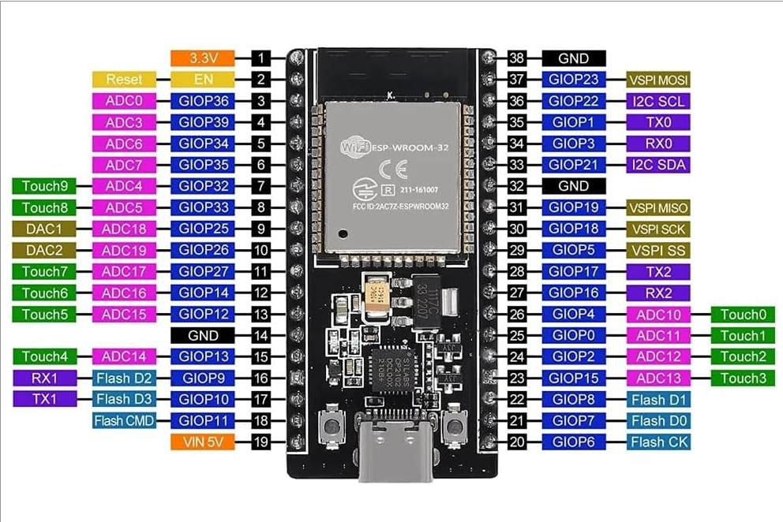

# BME280 Sensor Test

## Objective

Verify communication between the ESP32 and BME280 environmental sensor using I2C.

## Hardware

- ESP32 Dev Board
- BME280 Sensor
- Breadboard
- Jumper Wires

## Wiring

| BME280 | ESP32 |
|---------|---------|
| VIN | 3V3 |
| GND | GND |
| SDA | GPIO21 |
| SCL | GPIO22 |

## Procedure

1. Solder header pins onto BME280 module.
2. Connect sensor to ESP32 using I2C.
3. Verify communication using I2C scanner.
4. Verify sensor identity using Chip ID register.
5. Read temperature, humidity, and pressure values.

## Results

The BME280 sensor successfully communicated with the ESP32 using I2C at address 0x76.

Measured data:

- Temperature: 22.75 °C
- Humidity: 30.08 %
- Pressure: 1009.78 hPa

Diagnostic data:

- I2C Scanner detected the sensor at address 0x76.
- Chip ID register returned 0x60, confirming a genuine BME280 sensor.
- Environmental data was successfully acquired from the sensor.

## Notes

The sensor was initially not detected using the default example code from the Adafruit BME280 library. After verifying that the ESP32 was recognizing the device at address 0x76, an I2C scanner sketch was ran but resulted in error messages. After close inspection, a thin bridge connecting two channels on the sensor was found. Once that channel was removed, the sensor worked as desired.

## Associated Test Files

- i2c_scanner.ino
- chip_id_test.ino
- bme280_test.ino

## Reference Images

### ESP32 Pinout

