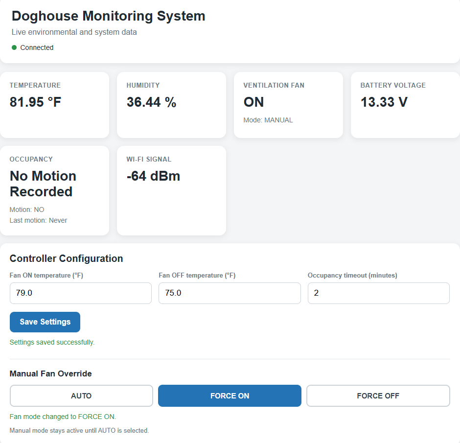

# Dashboard Configuration

## Objective

Expand the existing local web dashboard by allowing users to modify controller operating parameters directly from a web browser. This phase transforms the dashboard from a read-only monitoring interface into an interactive control interface capable of updating controller settings without requiring a direct USB connection.

---

## Features Implemented

### Wireless Controller Configuration

The following controller parameters can now be adjusted directly through the dashboard:

- Fan ON temperature
- Fan OFF temperature
- Occupancy timeout

Configuration changes are immediately applied to the controller without requiring a USB connection or serial commands.

---

### Persistent Configuration

All controller settings are stored using the ESP32 Preferences library.

Saved parameters remain after:

- Controller restart
- Power loss
- Battery disconnect

---

### Manual Fan Override

Three operating modes were implemented.

- AUTO
- FORCE ON
- FORCE OFF

AUTO returns control to the temperature controller.

FORCE ON keeps the ventilation fan running continuously until AUTO is re-selected.

FORCE OFF disables automatic fan operation until AUTO is re-selected.

---

### Dashboard Improvements

Additional dashboard functionality includes:

- Save confirmation messages
- Active operating mode indicator
- Highlighted override selection
- Integer temperature increments
- Improved controller organization
- Automatic refresh of updated controller values
  

---

## Software Architecture

Dashboard configuration is implemented using:

- HTML
- CSS
- JavaScript
- JSON
- ESP32 HTTP Server
- ESP32 Preferences

Configuration requests are sent to dedicated HTTP endpoints where the controller validates incoming values before updating runtime settings and saving them to flash memory.

---

## Validation

The completed configuration interface was validated by verifying:

- Wireless parameter updates
- Immediate controller response
- Persistent parameter storage
- Manual fan override
- Automatic return to controller operation after selecting AUTO
- Dashboard synchronization after parameter changes
- Input validation

---

## Notes

### Incremental Development

The dashboard was intentionally expanded after the monitoring interface had been fully validated.

Separating monitoring from configuration reduced debugging complexity while allowing each feature to be verified independently.

---

### Manual Fan Override

Manual override currently remains active until AUTO mode is selected.

This behavior was intentionally chosen because the dashboard is primarily used during development and testing.

Future versions may introduce configurable override durations.

---

### Charging Status

Charging status remains deferred.

Although battery voltage is available, voltage alone cannot accurately determine charging or discharging status for a LiFePO₄ battery.

Future implementation will utilize an INA219 current monitoring module.

---

### Dashboard Redesign

The current interface prioritizes functionality.

A complete UI redesign is planned during Phase 6.

Planned improvements include:

- Multi-page dashboard
- Home page
- Settings page
- Advanced page
- Historical graphs
- Power statistics
- Configurable manual override timeout

---

## Summary

Phase 4.3 transformed the local dashboard from a read-only monitoring interface into a fully interactive controller.

Users can now configure controller parameters wirelessly, save persistent settings, and manually control ventilation directly from any device connected to the local network.

This phase completes the functional user interface for the embedded monitoring system while providing the foundation for future advanced dashboard features.
